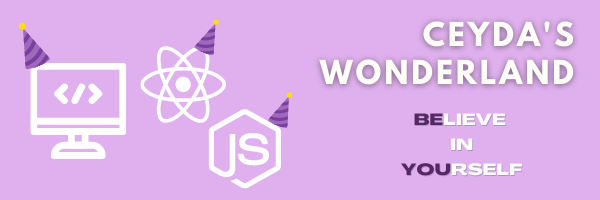

  

 

### Hey 👋🏻,

As a teenager at school, I was the girl who was formatting to her own computer without any guides just by doing the research. It doesn’t matter I graduated from law school and practicing for around 10 years now.
Today, I took an opportunity and changed my career into a web developer.

I am writing codes, using libraries for my HTML to make a delicate website. Using JavaScript, jQuery for back-ends also for responsiveness. I do have adequate knowledge of object-oriented programming and databases as well. So you can fins some fun projects in my repo ✨

## 📬 Get in touch with me

- Web: [ceydahergul.com][1] - `coming soon`
- LinkedIn: [https://www.linkedin.com/in/ceyda-hergul/][2]
- Twitter: [twitter.com/chergul][3]

## 🤜🏻🤛🏻 Support Me

You can support me and [buy me a coffee][4], if you want. 🙏🏻 

## 💬 Ask me anyting

ceyda_hergul@hotmail.com

## 👯 Looking to colobrate

Amazing, mindfull people 😄 

[1]: https://www.ceydahergul.com
[2]: https://www.linkedin.com/in/ceyda-hergul
[3]: https://twitter.com/intent/follow?screen_name=chergul
[4]: https://www.buymeacoffee.com/chergul
